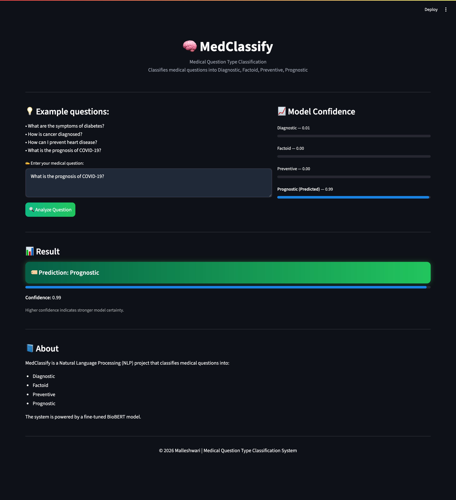

# 🧠 MedClassify – Medical Question Type Classification

## 📌 Overview

MedClassify is a Natural Language Processing (NLP) project that classifies medical questions into four categories:

* Diagnostic
* Factoid
* Preventive
* Prognostic

The project explores baseline modeling, data balancing techniques, and domain-specific modeling (**BioBERT**), and demonstrates an end-to-end pipeline from model training to real-world deployment using **Streamlit on Hugging Face Spaces**.

---

## 🚀 Live Demo

🔗 https://huggingface.co/spaces/malleshwarib/MedClassify

---

## 📸 Application Preview

### 🏠 Home Interface

*Initial UI before entering any question*


---

### 🔍 Prediction Output

*Example prediction with model confidence visualization*



---

## 🛠️ Tech Stack

* Python
* PyTorch
* Hugging Face Transformers
* Streamlit
* BERT
* BioBERT

---

## 📊 Dataset

* Source: Custom medical question dataset (mental health domains such as Anxiety, Depression, OCD)
* Training samples: 56,142
* Test samples: 2,474
* Classes: Diagnostic, Factoid, Preventive, Prognostic

### Preprocessing

* Text cleaning (lowercasing, punctuation removal)
* Tokenization using Hugging Face Transformers
* Data balancing:

  * Oversampling applied across classes
  * Targeted augmentation applied to minority class

---

## ⚙️ Project Workflow

### 🔹 Phase 1: Baseline Model

* Model: BERT
* Dataset: Original (imbalanced)
* Notebook: `bert_baseline.ipynb`
* Accuracy: **79.87%**

---

### 🔹 Phase 2: Data Balancing

* Oversampling across classes
* Augmentation applied to minority class
* Notebook: `bert_finetuning.ipynb`
* Accuracy: **77.2%**

---

### 🔹 Phase 3: Domain-Specific Model (BioBERT)

* Model: BioBERT
* Trained on processed dataset
* Notebook: `biobert_finetuning.ipynb`
* Accuracy: **78.03%**

---

## 📊 Results & Discussion

| Model   | Strategy                    | Accuracy |
| ------- | --------------------------- | -------- |
| BERT    | Baseline (imbalanced)       | 79.87%   |
| BERT    | Oversampling + Augmentation | 77.2%    |
| BioBERT | Balanced + Augmentation     | 78.03%   |

### 🔍 Key Observations

* Baseline BERT achieved the highest accuracy
* Data balancing slightly reduced accuracy but improves class representation
* BioBERT performs better on domain-specific data

👉 Additional evaluation using Macro F1 indicates improved balance across classes despite slight accuracy drop.

---

## 🎯 Future Work

* Evaluate advanced biomedical models (e.g., MedGemma)
* Explore advanced augmentation techniques
* Develop chatbot interface for interactive Q&A
* Improve deployment scalability using cloud-based hosting

---

## 📂 Project Structure

```text id="9xj8k3"
MedClassify/
│── app.py
│── requirements.txt
│── datasets/
│── notebooks/
│── outputs/
│── README.md
```

---

## 📦 Installation (Local Setup)

```bash id="r2c8w1"
git clone https://github.com/malleshwari-b577/MedClassify.git
cd MedClassify
pip install -r requirements.txt
streamlit run app.py
```

---

## ⚠️ Note

* The trained model (~433MB) is hosted on Hugging Face Model Hub
* It is not included in this repository due to size limitations

---

## 👩‍💻 Developer

Malleshwari

---

## 📜 Credits

**Mr. Panigrahi Srikanth**
Assistant Professor, Dept. of AIML

---

## 📄 License

MIT License

---

## 📝 Disclaimer

This application is a research prototype designed to demonstrate medical text classification and is not intended for clinical use.
